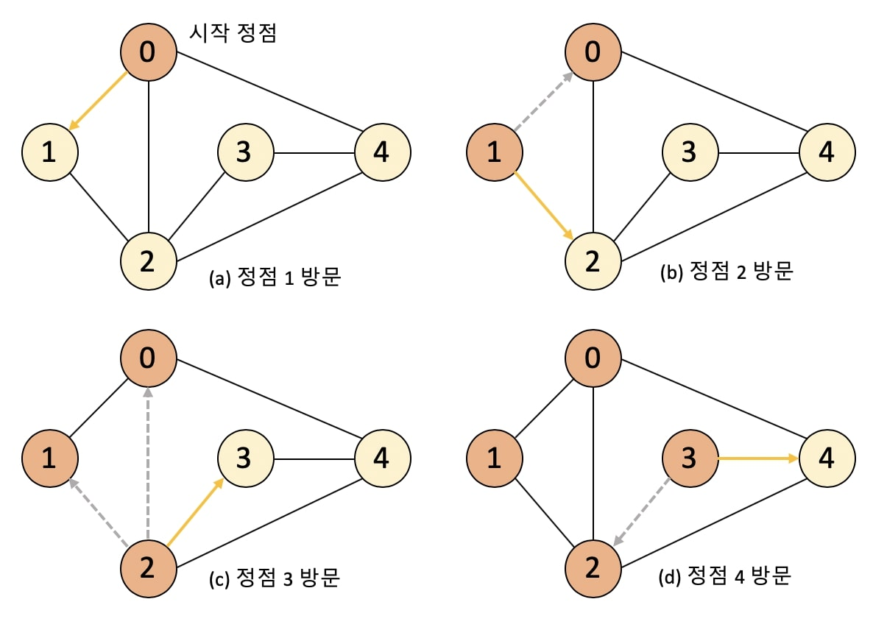
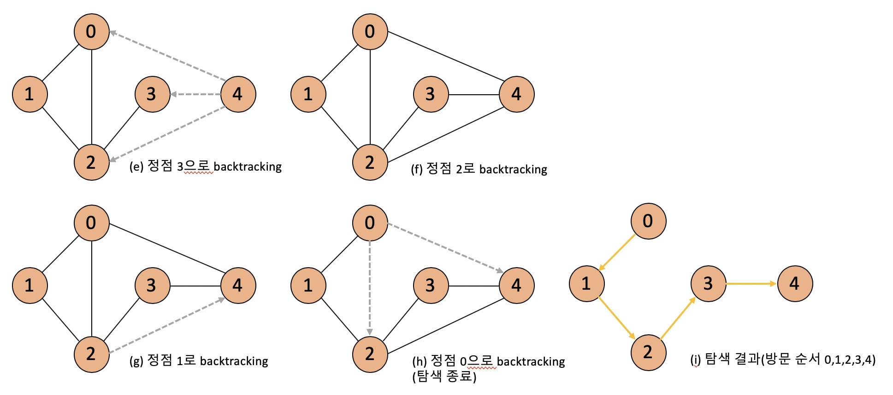
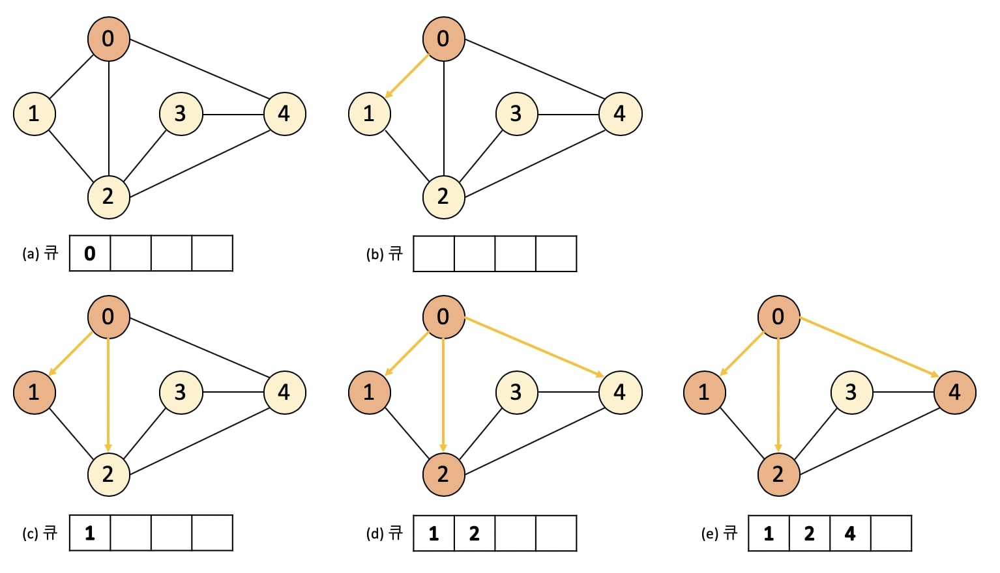
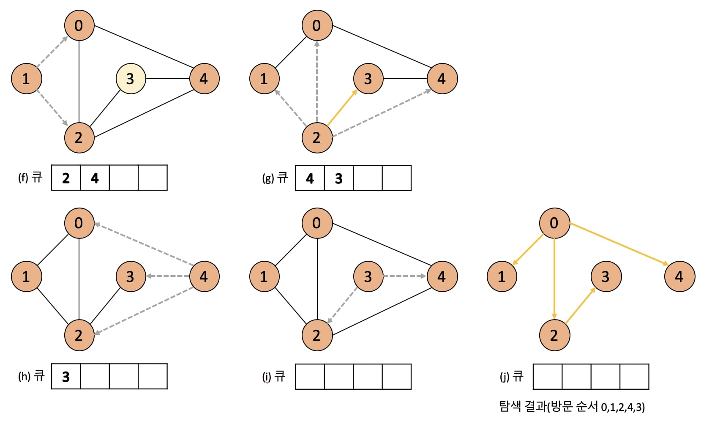

# 그래프 탐색 알고리즘 (DFS/BFS))
* 탐색(Search): 많은 양의 데이터 중에서 원하는 데이터를 찾는 과정 <br>
ex) 선형 검색, 이진 검색, 너비우선탐색(BFS), 깊이우선탐색(DFS)

<br>

## 1. DFS (Depth-First Search)
**깊은 부분을 우선적으로 탐색**하는 알고리즘이다.

\- 스택 자료구조(혹은 재귀 함수) 이용

### 동작 예시
* 최대한 깊게 들어가는 형태로 동작한다.




```
* [Step1] 시작 노드인 '0'을 스택에 삽입하고 방문 처리를 한다.
* [Step2] 스택의 최상단 노드인 '0'에 방문하지 않은 인접 노드 '1', '4'가 있다.
이 중 가장 작은 노드 '1'를 스택에 넣고 방문 처리한다.
* [Step3] 스택 최상단 노드인 '1'에 방문하지 않은 인접 노드 '2'를 스택에 넣고 방문 처리한다.
```
```
0->1->2->3->4
```

### 소스 코드 예제
```python
# 함수 정의
def dfs(graph,v,visited):
    # 현재 노드를 방문 처리
    visited[v] = True
    print(v,end=' ')
    # 현재 노드와 연결된 다른 노드 재귀적 방문
    for i in graph[v]:
        if not visited[i]:
            dfs(graph,i,visited)

# 각 노드가 연결된 정보 표현
graph = [
    [1,2,4],
    [0,2],
    [0,1,3],
    [2,4],
    [0,2,3]
]

# 각 노드가 방문된 정보 표현 
visited = [False] * 5

dfs(graph, 0, visited)
```

<br>

## 2. BFS (Breadth-First Search)
**가까운 노드부터 우선적으로 탐색**하는 알고리즘이다.

\- 큐 자료구조 이용

### 동작 예시
* 너비 우선 탐색으로 시작 노드로부터 가까운 노드를 우선적으로 탐색한다.




```
* [Step1] 시작 노드인 '0'을 큐에 삽입하고 방문 처리를 한다.
* [Step2] 큐에서 노드 '0'을 꺼내 방문하지 않은 인접 노드 '1', '2', '4'를 큐에 삽입하고 방문 처리한다.
* [Step3] 큐에서 노드 '1'를 꺼내고 방문하지 않은 인접 노드가 없
기 때문에 노드 '2'를 꺼내고 '3'을 큐에 넣고 방문 처리한다.
```
```
0->1->2->4->3
```
1,2,4는 0으로부터 1만큼 떨어져 있고, 3은 2만큼 떨어져 있어 너비 우선 탐색임을 다시 한번 알 수 있다.

### 소스 코드 예제
```python
from collections import deque

# 함수 정의
def bfs(graph,start,visited):
    queue = deque([start])
    # 현재 노드를 방문 처리
    visited[start] = True

    # 큐가 빌 때까지 반복
    while queue:
        # 큐에서 하나의 원소 뽑아서 출력
        v = queue.popleft()
        print(v, end='')
        # 아직 방문하지 않은 인접한 원소들을 큐에 삽입
        for i in graph[v]:
            if not visited[i]:
                queue.append(i)
                visited[i]=True

# 각 노드가 연결된 정보 표현
graph = [
    [1,2,4],
    [0,2],
    [0,1,3],
    [2,4],
    [0,2,3]
]

# 각 노드가 방문된 정보 표현 
visited = [False] * 5

bfs(graph, 0, visited)
```

<br>

## 3. 문제 풀이
* 백준 온라인 저지
* [1260번, DFS와 BFS](https://www.acmicpc.net/problem/1260)

* queue를 구현할 때 리스트가 아닌 deque 라이브러리를 사용하는 이유는 리스트로 사용했을 때 시간복잡도가 더 높을 수 있기 때문에 deque라이브러리 사용한다.

```python
# 1260번 , 설명.ver

from collections import deque

# n이 노드 개수, m이 연결된 선 개수, v가 시작노드
n, m, v = map(int,input().split())

# 인덱스가 노드 번호를 뜻하기 때문에 n은 1부터 시작해서
# 0번째 인덱스는 안써서 n+1개
graph = [[0]*(n+1) for i in range(n+1)]
print(graph)

visited = [False]*(n+1)
print(visited)

for i in range(m):
    x, y = map(int,input().split())
    graph[x][y] = graph[y][x] = 1
print(graph)

# DFS
def dfs(v):
    # 현재 노드를 방문 처리
    visited[v] = True
    print(v,end=' ')
    
    for i in range(1,n+1):
        # 현재 노드랑 연결되어 있으면서 방문하지 않은 곳
        if graph[v][i] == 1 and not visited[i]:
            dfs(i)

# BFS
def bfs(v):
    queue = deque([v])
    # 현재 노드를 방문 처리 (dfs에서 모두 True로 바뀌어서 반대로)
    visited[v] = False
    
    # 큐가 빌 때까지 반복
    while queue:
        # 큐에서 하나의 원소 뽑아서 출력
        v = queue.popleft()
        print(v,end=' ')
        
        # 아직 방문하지 않은 인접한 원소들을 큐에 삽입
        for i in range(1,n+1):
              if graph[v][i] == 1 and visited[i]:
                  queue.append(i)
                  visited[i] = False
            
            
dfs(v)
print()
bfs(v)
```

<br>

---
## Reference & Additional Resources
* [한빛미디어] 이것이 취업을 위한 코딩 테스트다 with 파이썬 (나동빈 저)
* [사진 출처](https://github.com/HyeminNoh/Tech-Stack)