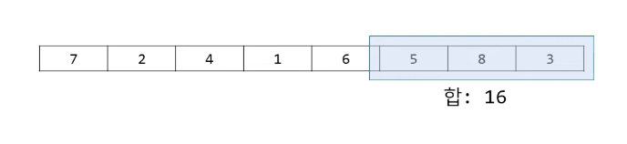

## 슬라이딩 윈도우(Sliding Window)

> [관련 영상](https://youtu.be/uH9VJRIpIDY)

### 알고리즘 설명

- 창문을 왼쪽부터 시작하여 한 칸씩 오른쪽으로 이동
- 매 순간 창문 안에서의 정보 유출 필요



- 기본 아이디어

```
Window를 한 칸 옮기면 (W-1) 칸은 겹친다!
```

### 관련 문제 유형

> 관련 문제: 백준, 20437

1. 구간 합

2. Anagram
> 문제: 백준, 1593

- 아나그램이란, 알파벳의 구성은 유지한 채, 순서만 뒤바귄 단어 관계를 의미한다.
    - ex. listen <-> silent

#### [문제 예시]

s1 : abr
s2 : abracadabra

-> 정답: 3

한 칸 옮기면 (w-1)칸 겹치는 것을 활용!!

즉, 이전의 결과를 활용하는 방식으로 풀자!

3. 구간 최솟값

> 문제: 백준 11003