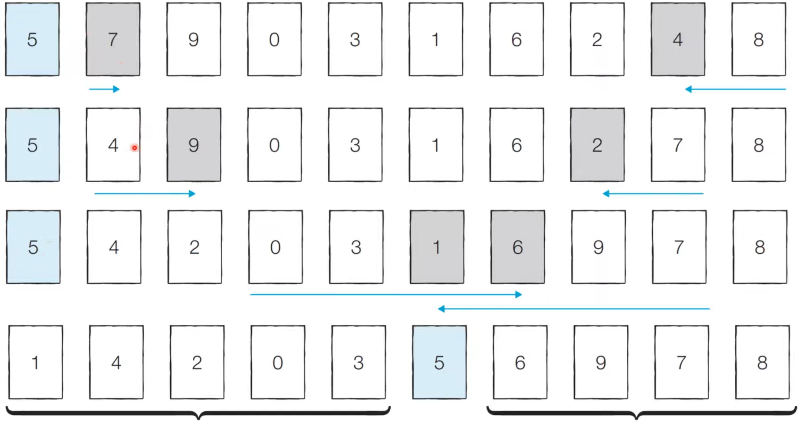

# 정렬 (Sorting)
정렬이란 데이터를 특정한 기준에 따라 순서대로 나열하는 것을 말한다.
<br>

## 1. 선택 정렬 (Selection Sort)
**선택 정렬**은 처리되지 않은 데이터 중에서 가장 작은 데이터를 **선택**해 알맞은 위치로 옮겨 순서대로 정렬하는 알고리즘이다.

### 동작 예시

* [Step0] 처리되지 않은 데이터 중 가장 작은 '1'을 선택해 가장 앞의 '2'와 바꾼다.
* [Step1] 처리되지 않은 데이터 중 가장 작은 '2'를 선택해 가장 앞의 '5'와 바꾼다.
* [Step2] 처리되지 않은 데이터 중 가장 작은 '3'를 선택해 가장 앞의 '4'와 바꾼다.
* [Step3] 처리되지 않은 데이터 중 가장 작은 '4'를 선택해 가장 앞의 '5'와 바꾼다.

### 특징
* 탐색 범위는 반복할 때마다 줄어들고 매번 가장 작은 값을 찾기 위해 탐색범위만큼 값을 확인해야하기 때문에 매번 선형탐색을 수행하는 것과 같다.
* 아이디어가 매우 간단하다.

### 시간복잡도
* 이중 반복문
> **O(N<sup>2</sup>)**

<br>

## 2. 삽입 정렬 (Insertion Sort)
처리되지 않은 데이터를 하나씩 골라 **적절한 위치에 삽입**하여 정렬하는 알고리즘이다.

### 동작 예시

* [Step0] 첫번 째 데이터 '5'은 정렬 되었다고 판단하고, 두번째 데이터 '2' 위치 판단한다. '5'의 왼쪽 오른쪽 두 경우만 존재한다.
* [Step1] 이어서 '4'가 어디에 들어갈 지 판단한다.
* [Step2] 이어서 '1'이 어디에 들어갈 지 판단한다.
* [Step3] 이어서 '3'이 어디에 들어갈 지 판단한다.

### 특징
선택 정렬에 비해 구현 난이도가 높은 편이지만, 일반적으로 더 효율적으로 동작한다.

### 시간복잡도
> **O(N<sup>2</sup>)**
* 이중 반복문 (but 모든 이중 반복문이 O(N<sup>2</sup>)은 아니다.)
* 현재 리스트의 데이터가 거의 정렬되어 있는 상태라면 매우 빠르게 동작한다.
    * 최선의 경우 **O(N)**

<br>

## 3. 퀵 정렬 (Quick Sort)
일반적으로 사용되고 있는 아주 빠른 정렬 알고리즘이다.
* 기준 데이터를 설정하고 그 **기준보다 큰 데이터와 작은 데이터의 위치를 바꾸는 방법**이다.
* 가장 기본적인 퀵 정렬은 **첫 번째 데이터를 기준 데이터(Pivot)** 로 설정한다.

### 동작 예시

* [Step0] 현재 피벗 값은 '5'. 왼쪽에서부터 '5'보다 큰 데이터를 선택하고, 오른쪽에서부터 '5'보다 작은 데이터를 선택한다. 그 다음 두 데이터의 위치를 변경한다.
* [Step1] 이 과정을 반복하다가 '1'과 '6'이 선택되듯이 위치가 엇갈리는 경우 '피벗'과 '작은 데이터'의 위치를 서로 변경한다.
* **[분할 완료]** 왼쪽 데이터 묶음을 정렬하고 오른쪽 데이터 묶음을 정렬한다.
## 특징
* 재귀함수를 사용하는 방식의 문제풀이 방법

### 시간복잡도
> 평균의 경우: O(NlogN) <br>
> 최악의 경우: O(N<sup>2</sup>)

<br>

## 4. 문제 풀이
[프로그래머스 가장 큰 수](https://programmers.co.kr/learn/courses/30/lessons/42746)

* 문제 설명
    * 어떤 과학자가 발표한 논문 n편 중, h번 이상 인용된 논문이 h편 이상이고 나머지 논문이 h번 이하 인용되었다면 h의 최댓값이 이 과학자의 H-Index이다.  
    * 즉, 이 과학자의 H-Index는 발표한 논문 편 수를 넘을 수 없다.  
    * 5편의 논문을 썼는데, 다섯편 모두 5번 이상 인용되었다면 H-Index 는 5
    * 다섯편 발표했는데, 5번 이상 인용된 논문이 4편 이라면 H-Index는 4 이다. 
    * [3, 0, 6, 1, 5]에서 이 과학자는 총 5편의 논문을 발표했는데,  일단 5번 이상 인용된 논문은 2편,  3번이상 인용된 논문은 3 이므로 H-Index 는 3. 


```python 
def solution(citations):
    citations.sort(reverse=True)
    for idx, i in enumerate(citations):
        if i <= idx:
            return idx
            break
    return len(citations)
```


<br>

---
## Reference & Additional Resources
* [한빛미디어] 이것이 취업을 위한 코딩 테스트다 with 파이썬 (나동빈 저)
* [사진 출처 1](https://velog.io/@kim-jaemin420/%EC%95%8C%EA%B3%A0%EB%A6%AC%EC%A6%98%EC%84%A0%ED%83%9D-%EC%A0%95%EB%A0%AC%EA%B3%BC-%EC%82%BD%EC%9E%85-%EC%A0%95%EB%A0%AC)