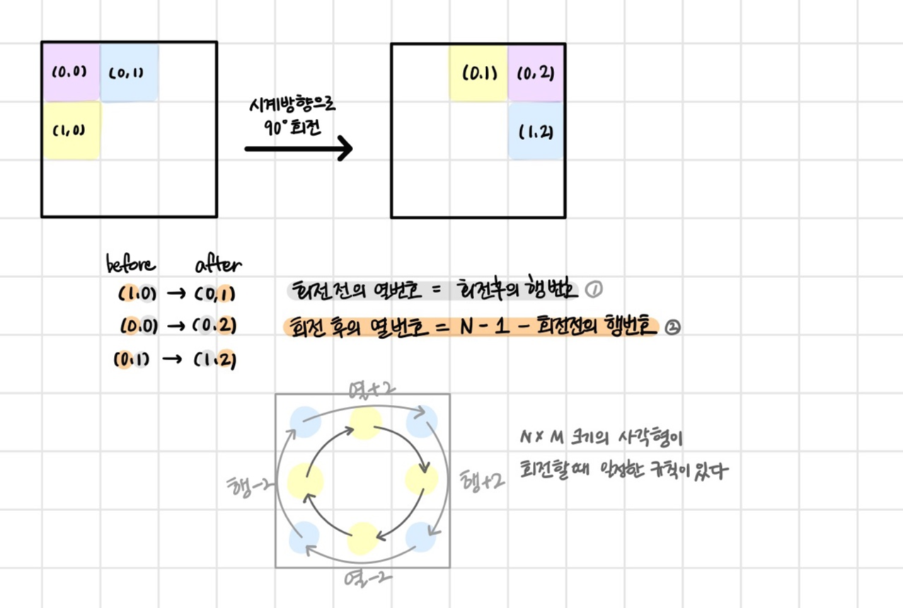

# 회전 알고리즘

## 한 칸씩 이동

> [(16927) 배열 돌리기2](https://www.acmicpc.net/problem/16927)

> [(17144) 미세먼지 안녕!](https://www.acmicpc.net/problem/17144)

## 2차원 배열 회전

> [(12100) 2048 (Easy)](https://www.acmicpc.net/problem/12100)

### 방법 1

### [[Python] zip() 이용해서 2차원 리스트 회전하기](https://velog.io/@mmy789/Python-zip-%EC%9D%B4%EC%9A%A9%ED%95%B4%EC%84%9C-2%EC%B0%A8%EC%9B%90-%EB%A6%AC%EC%8A%A4%ED%8A%B8-%ED%9A%8C%EC%A0%84%ED%95%98%EA%B8%B0)

```py
'''
시계 방향으로 90도 회전
'''

mylist = [[1, 2, 3], [4, 5, 6], [7, 8, 9]]
new_list = list(map(list, zip(*mylist[::-1])))

for i in mylist:	# 기존 리스트
    print(i)

print()

for i in new_list:	# 회전한 리스트
    print(i)

'''
반시계 방향으로 90도 회전
'''

mylist = [[1, 2, 3], [4, 5, 6], [7, 8, 9]]
new_list = list(map(list, zip(*mylist)))[::-1]

for i in mylist:	# 기존 리스트
    print(i)

print()

for i in new_list:	# 회전한 리스트
    print(i)
```

### 방법 2
> 출처: https://blackon29.tistory.com/63




### ✔️ 90도 회전

```py
def rotate_2d(list_2d):
    n = len(list_2d) # 행 길이 계산
    m = len(list_2d[0]) # 열 길이 계산
    new = [[0] * n for _ in range(m)]
    for i in range(n):
        for j in range(m):
            new[j][n-i-1] = list_2d[i][j]
    return new
```

### ✔️ 180도 회전

90도 회전을 두 번 하는 것이니, [j] 열 입장에서도 사이클이 생긴다.

```py
def rotate_2d(list_2d):
    n = len(list_2d) # 행 길이 계산
    m = len(list_2d[0]) # 열 길이 계산
    new = [[0] * n for _ in range(m)]
    for i in range(n):
        for j in range(m):
            new[m-j-1][n-i-1] = list_2d[i][j]
    return new
```

### ✔️ 270도 회전

90도 회전을 세 번 하는 것인데, 즉 -90도 회전하는 것과도 같다. 또는 180 + 90도 회전으로 이해할 수 있다.

```py
def rotate_2d(list_2d):
    n = len(list_2d) # 행 길이 계산
    m = len(list_2d[0]) # 열 길이 계산
    new = [[0] * n for _ in range(m)]
    for i in range(n):
        for j in range(m):
            new[m-j-1][i] = list_2d[i][j]
    return new
```