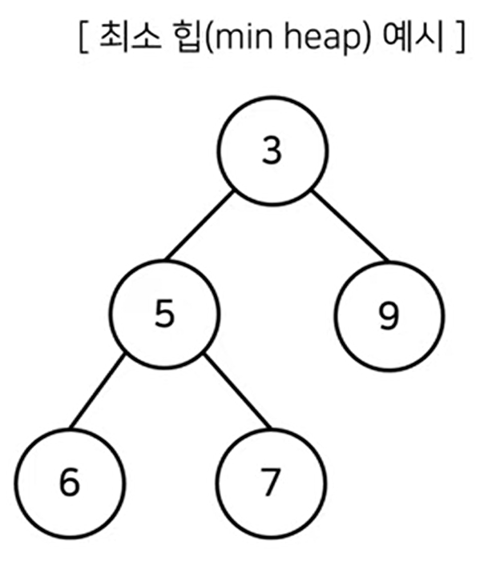
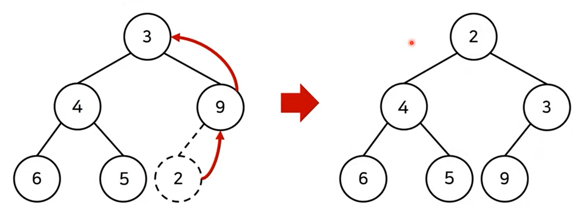
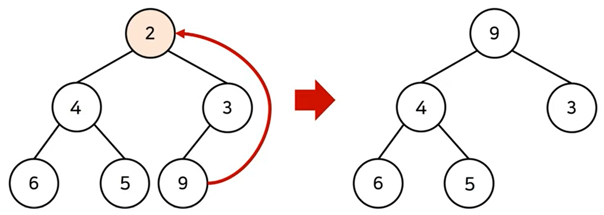
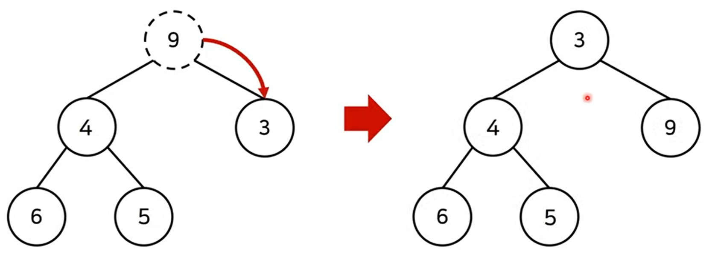

# 우선순위 큐(Priority Queue) & 힙(Heap)

## 1. 우선순위 큐 (Priority Queue)

<u>우선순위가 가장 높은 데이터를 가장 먼저 삭제하는 자료구조</u>

- 데이터의 **우선순위에 따라** 처리하고 싶을 때 사용
  - ex) 물건 데이터를 자료구조에 넣었다가 가치가 높은 물건부터 꺼내서 확인해야 하는 경우

### 구현 방법

1. 리스트
2. 힙(heap)을 이용하여 구현

| 우선순위 큐 구현 방식 | 삽입 시간 | 삭제 시간 |
| :-------------------: | --------- | :-------: |
|        리스트         | O(1)      |   O(N)    |
|       힙(Heap)        | O(logN)   |  O(logN)  |

- **힙 정렬**
  : 단순히 N개의 데이터를 힙에 넣었다가 모두 꺼내는 작업은 정렬과 동일하다.
  - 시간 복잡도: O(NlogN)

<br>

## 2. 힙 (Heap)

최솟값 또는 최댓값을 빠르게 찾기 위해 고안된 완전 이진 트리 자료구조의 일종

힙은 항상 **루트 노드(root node)를 제거**

### 최소 힙(min heap)

- 루트 노드가 가장 작은 값을 가진다.
- 따라서 값이 작은 데이터가 우선적으로 제거된다.

  

< 최소 힙 구성 함수: `Min-Heapify()`>

- 최소 힙 성질을 만족하도록 위치를 교체함.

<br>

< 원소 삽입 >



<원소 삭제>




<br>

### 최대 힙(max heap)

- 루트 노드가 가장 큰 값을 가진다.
- 따라서 값이 큰 데이터가 우선적으로 제거된다.

<br>

## 3. 구현 예제

< 우선순위 큐 라이브러리를 활용한 힙 정렬 구현 예제 >

`import heapq`

`파이썬의 heapq 모듈로 최소 힙을 사용할 수 있다.`
-> 최대 힙이 필요할 땐 값을 저장할 때 **-1을 곱한 값** 저장

기본적으로 오름차순으로 정렬된다.

```py
import sys
import heapq
input = sys.stdin.readline

def heapsort(iterable):
    h = []
    result = []
    # 모든 원소를 차례대로 힙에 삽입
    for value in iterable:
        heapq.heappush(h,value)
    # 힙에 삽입된 모든 원소를 차례대로 꺼내어 담기
    for i in range(len(h)):
        result.append(heapq.heappop(h))
    return result

n = int(input())
arr = []

for i in range(n):
    arr.append(int(input()))
res = heapsort(arr)

for i in range(n):
    print(res[i])
```

---

## Reference & Additional Resources

- [한빛미디어] 이것이 취업을 위한 코딩 테스트다 with 파이썬 (나동빈 저)
- **Elice Ai Track**에서 제공하는 강의자료
