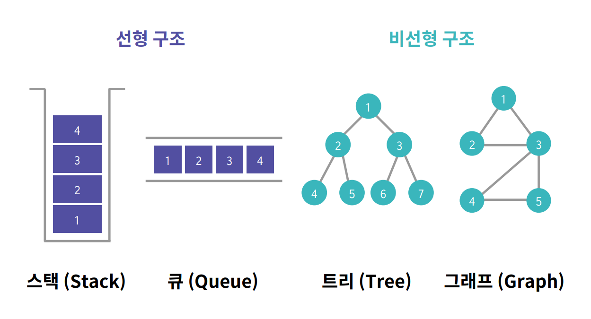

> **Elice Ai Track**에서 제공하는 강의자료를 바탕으로 작성하였습니다.

## 스택과 큐

### 1. 개념



<br>

**스택**

<u>한쪽 끝에서만</u> 자료를 넣고 뺄 수 있는 자료구조

Last In First Out (LIFO) 자료, 후입선출

- 구현

: **파이썬 리스트**로 구현 가능

- 연산 목록
  - push: 스택에 자료를 넣는 연산
  - pop : 스택에서 자료를 빼는 연산
  - top : 스택의 가장 위에 있는 자료를 반환하는 연산
  - empty : 스택이 비어있는지 여부를 반환하는 연산

<br>

**큐**

입구와 출구가 <u>각각 한 쪽 끝에</u> 존재하는 자료구조

First In First Out (FiFO) 자료

- 구현

: **queue 모듈의 Queue 클래스**

```python
import queue
q = queue.Queue()
```

- 큐를 배열로 구현했을 때 문제 해결
  - 원형 큐, 링크드 큐

* 연산 목록
  - push : 큐에 자료를 넣는 연산
  - pop : 큐에서 자료를 빼는 연산
  - front : 큐의 가장 앞에 있는 자료를 반환하는 연산
  - back : 큐의 가장 뒤에 있는 자료를 반환하는 연산
  - empty : 큐가 비어있는지 여부를 반환하는 연산

<br>

### 2. 의미

- 스택: 의존관계가 있는 상태, 어떤 일보다 더 먼저 처리되어야 하는 일이 있다면, 스택에 저장.
  -> 재귀함수를 이용해서 스택을 대신할 수 있다.

- 큐: 의존관계가 없는 경우

<br>

### 3. 큐로 풀 수 있는 문제

< 요세푸스 순열 >

원이 회전하면 큐에서 자료를 출력한 후 그 출력한 자료를 다시 큐에 입력해주면 된다.

번부터 NNN번까지 번호를 가진 NNN명의 사람들이 있습니다.

1번부터 순서대로 KKK번째 사람을 원에서 제거합니다.

원을 이루고 있는 사람들이 모두 제거되었을 때,

제거된 사람들의 번호를 순서대로 나열한 것을 요세푸스 순열이라고 합니다.

```python
from queue import Queue

def josephus_sequence(n, k) :
    # n명의 사람들을 큐로 표현한다.

    q = Queue()

    result = []
    for i in range(1, n+1):
        q.put(i)

    # 요세푸스 순열 알고리즘에 의해서 큐에서 한명씩 빠진다.
    # 사람이 다 빠지면 반복문 종료.
    while not q.empty():

        for i in range(k):
            num = q.get()
            if i == k-1:
                result.append(num)
            else:
                q.put(num)

    return result
```
