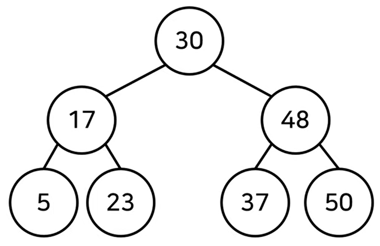

# 트리 (Tree)

비선형 구조, 그래프의 특수한 형태 중 하나이다.

## 1. 개념

### < 그래프 >

**정점**(vertex)과 **간선**(edge)로 이루어져 있는 자료구조

방향이 있는 간선을 포함한 그래프를 유향 그래프

처음 시작한 정점으로 다시 돌아오는 경로를 '사이클'

<br>

### < 트리 >

특별한 성질을 갖는 그래프를 트리, 가계도와 같은 계층적인 구조를 표현할 때 사용할 수 있는 자료구조.

- 트리의 크기가 `N`일 때, 전체 간선의 개수는 `N-1`개.

```
• 트리의 간선들은 모두 방향성을 갖는다.
• 어떤 정점을 가리키는 정점의 개수는 최대 1개이다.
• 어떤 정점에서 다른 정점으로 이동할 수 있는 경로는 1개다.
• 트리는 사이클을 갖지 않는다.
```

디렉터리(폴더) -> 트리 구조 예시

<br>

**< 이진 탐색 트리 >**



각 정점들이 자식 노드를 최대 2개까지만 갖는 트리

이진 탐색이 동작할 수 있도록 고안된 효율적인 탐색이 가능한 자료구조

#### 특징

```
왼쪽 자식 노드<부모 노드<오른쪽 자식 노드

- 부모 노드보다 왼쪽 자식 노드가 작다.
- 부모 노드보다 오른쪽 자식 노드가 크다.
```

<br>

### 트리의 순회

- 전위 순회(pre-order traverse): 루트를 먼저 방문
- 중위 순회(in-order traverse): 왼쪽 자식을 방문한 뒤에 루트를 방문합니다.
- 후위 순회(post-order traverse): 오른쪽 자식을 방문한 뒤에 루트를 방문합니다.

- 포화 이진 트리
  - 리프 노드를 제외한 모든 정점이 항상 자식을 2개씩 갖고 있으면서 모든 리프 노드의 깊이가 동일한 트리
  - 높이 h 라고 하면 정점 개수는 2<sup>h</sup>-1개 이다.
- 완전 이진 트리
  - 마지막 깊이를 제외하고 모든 정점이 완전히 채워져 있으며,
    마지막 깊이의 정점들은 가능한 한 왼쪽에 있는 트리
  - 루트 노드부터 시작하여 왼쪽 자식 노드, 오른쪽 자식 노드 순서대로 데이터가 삽입되는 트리
- 정 이진 트리
  - 정 이진 트리는 리프 노드를 제외한 모든 노드들이 두 개의 자식 노드를 갖고 있는 이진 트리

<br>

### 트리의 순회 구현 예제

```py
class Node:
  def __init__(self,data,left_node,right_node):
      self.data = data
      self.left_node = left_node
      self.right_node = right_node

# 전위 순회
def pre_order(node):
  print(node,data,end=' ')
  if node.left_node != None:
    pre_order(tree[node.left_node])
  if node.right_node != None:
    pre_order(tree[node.right_node])

# 중위 순회
def in_order(node):
  if node.left_node != None:
    in_order(tree[node.left_node])
  print(node,data,end=' ')
  if node.right_node != None:
    pre_order(tree[node.right_node])

# 후위 순회
def post_order(node):
  if node.left_node != None:
    in_order(tree[node.left_node])
  if node.right_node != None:
    pre_order(tree[node.right_node])
  print(node,data,end=' ')

n = int(input())
tree = {}

for i in range(n):
  data, left_node, right_node = input().split()
  if left_node == 'None':
    left_node = None
  if right_node == 'None':
    right_node = None
  tree[data] = Node(data, left_node, right_node)

pre_order(tree['A'])
print()
in_order(tree['A'])
print()
post_order(tree['A'])
```

<br>

## 2. 트리의 표현 방법

```py
class TreeNode:
    def __init__(self):
        self.left = None
        self.right = None
```

- 완전 이진 트리
  - 배열로 나타낼 수 있다.
  - 어떤 정점의 번호가 n이면 왼쪽 자식은 2n, 오른쪽 자식은 2n+1 이다.
  - 힙 나타낼 때 사용

<br>

## 3. 트리 순회하기

트리의 모든 노드를 방문하는 순서

: **DFS(깊이 우선 탐색)**과 **BFS(너비 우선 탐색)**

#### < DFS >

- 재귀 호출을 사용하는 알고리즘
- 스택의 특성을 이용하므로 스택을 이용한다고 볼 수 있다.

#### < BFS >

- 트리(그래프)의 BFS는 큐 자료구조를 이용하여 구현

<br>

## 4. 트리의 활용

- 정렬된 상태를 유지하는 배열의 시간 복잡도

- 이진 탐색 트리: 항상 정렬된 상태를 유지하는 자료구조

- 정점 왼쪽 트리는 그 정점보다 같거나 작은 정점들
- 오른쪽 트리는 그 정점보다 큰 정점들로만

---

## Reference & Additional Resources

- [한빛미디어] 이것이 취업을 위한 코딩 테스트다 with 파이썬 (나동빈 저)
- **Elice Ai Track**에서 제공하는 강의자료
